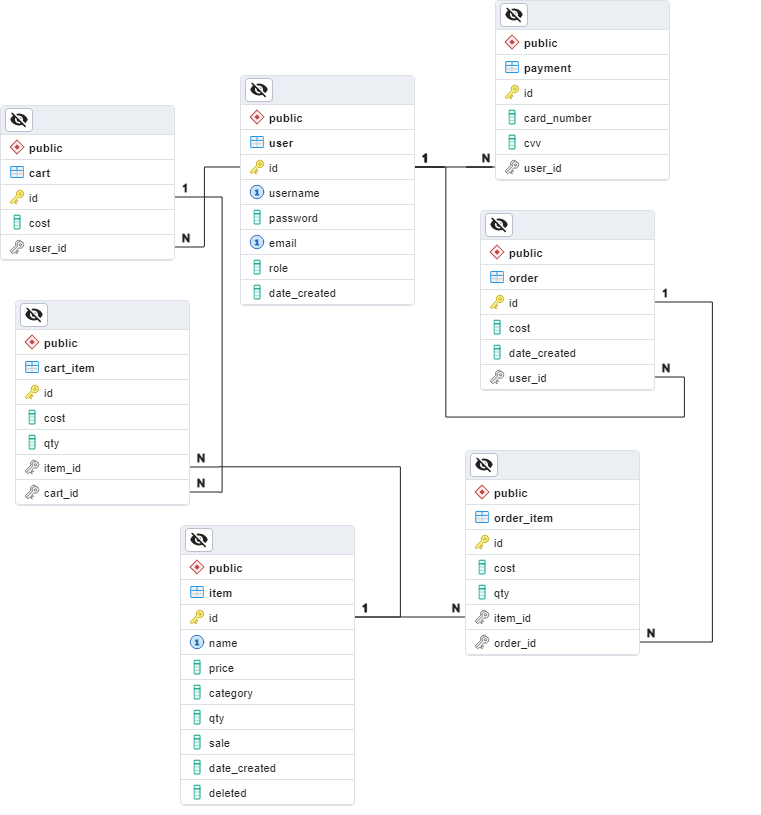

# Shopping Website Backend API

<http://3.17.10.48/docs>

This project provides a backend API for a shopping website, built using FastAPI and SQLAlchemy as the ORM to perform CRUD operations against a PostgreSQL database. It includes user registration, authentication with JWT tokens, cart management, purchase functionality, and a purchase history feature. The application is containerized using Docker and can be deployed on AWS Fargate for seamless scaling and management.

## Database Schemas

## Tech Stack
    1. FastAPI

    2. SQLAlchemy

    3. PostgreSQL

    4. Docker

    5. AWS Fargate

## Build
    1. clone this repo

    2. install docker desktop

    3. command to build the image: docker build -t ishop .

    4. command to run the container: docker-compose up

    5. go to -> localhost:8000/doc